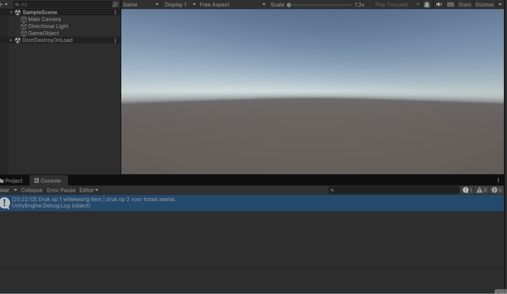
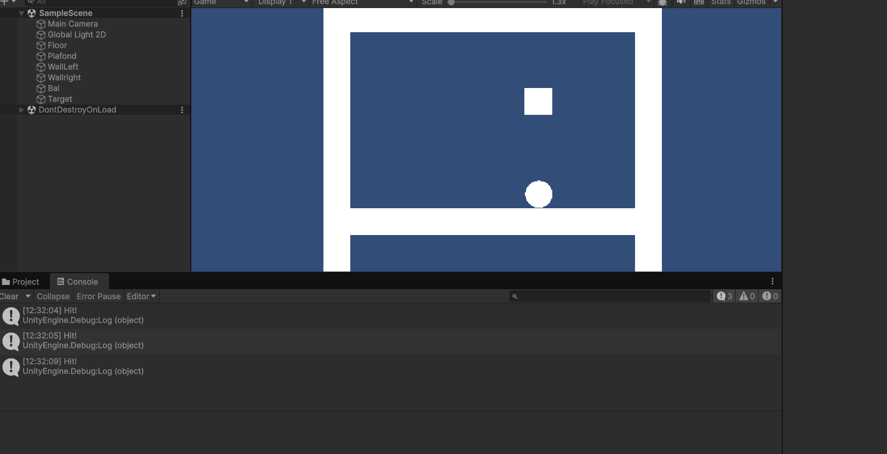
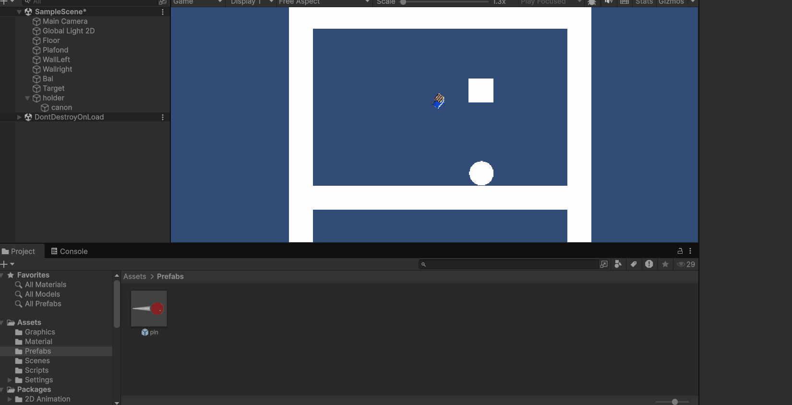
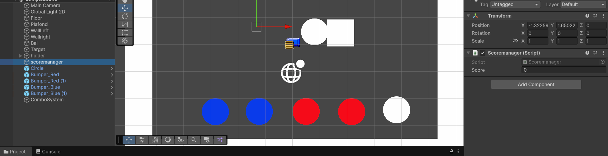
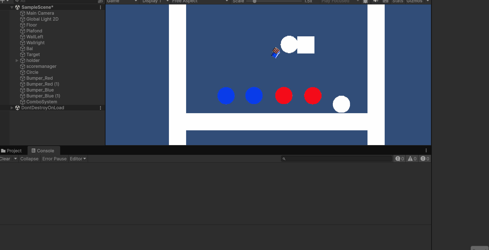

# M2_GDV2

# 1.1 GameConcept
Beschrijving Concept 

De speler schiet 
# 1.2 Random Items

Beschrijving:   Herhaling van datatypes, ik heb nummer 1 voor een willekeurig item, nummer 2 voor alle items.

Scripts: [Randomitems.cs](Assets/Scripts/randomitems.cs)

# 2.1 Forces & Collisons

Beschrijving: Add Force en Collider

# 2.2 Peggle Mikken

Beschrijving: Kanon en Mikken

# 3.1 Score & Triggers

Beschrijving: een Peggle die reageert wanneer de bal het object raakt, bijhoudt hoeveel hits er nog over zijn, punten doorgeeft aan de ScoreManager en verdwijnt zodra de ingestelde hoeveelheid hits is bereikt

# 3.2 Peggle Game, Combos, Multiplier, Events

Beschrijving: een combo systeem op basis van tags.

