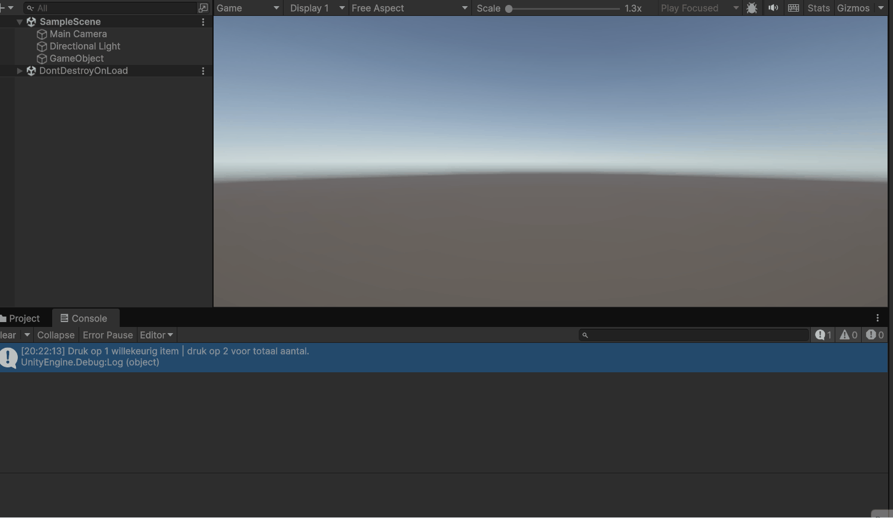
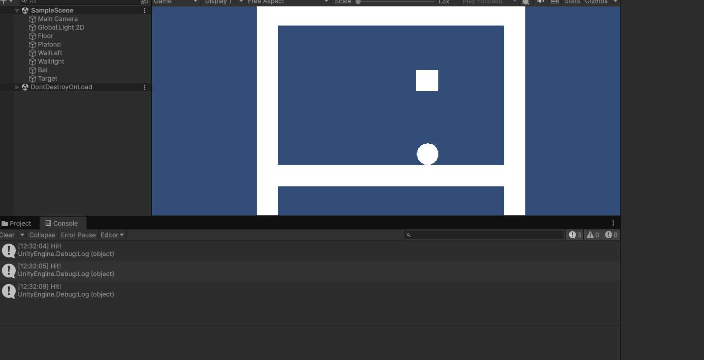
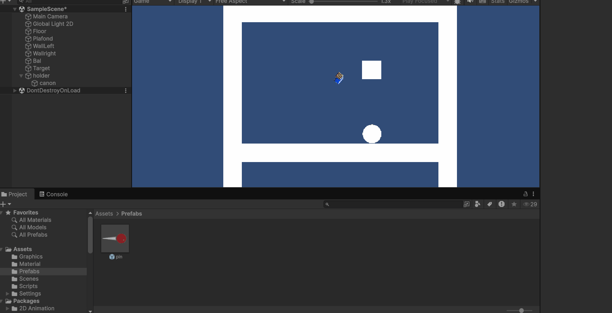
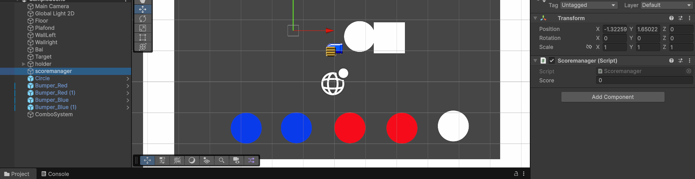
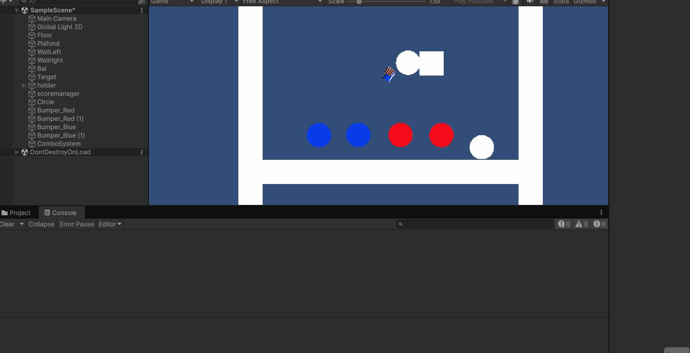
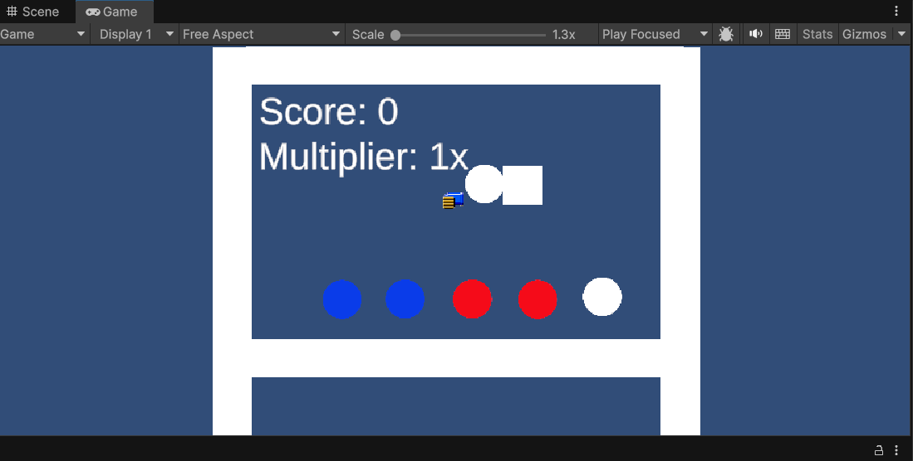
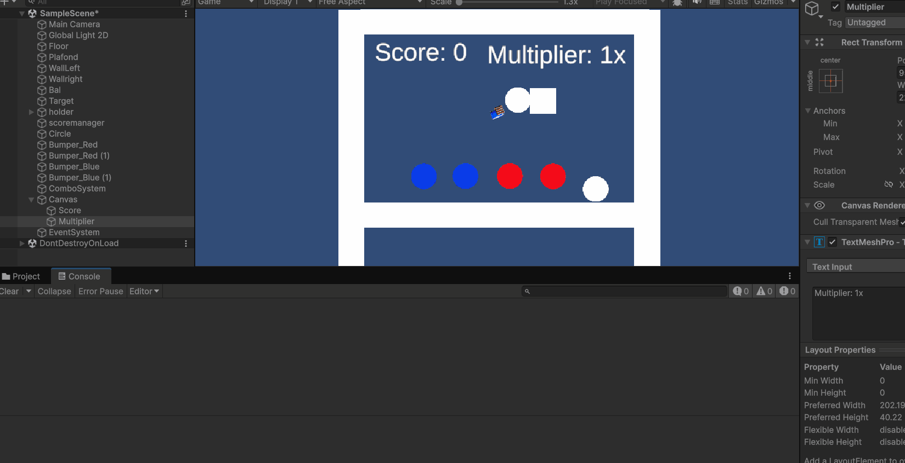
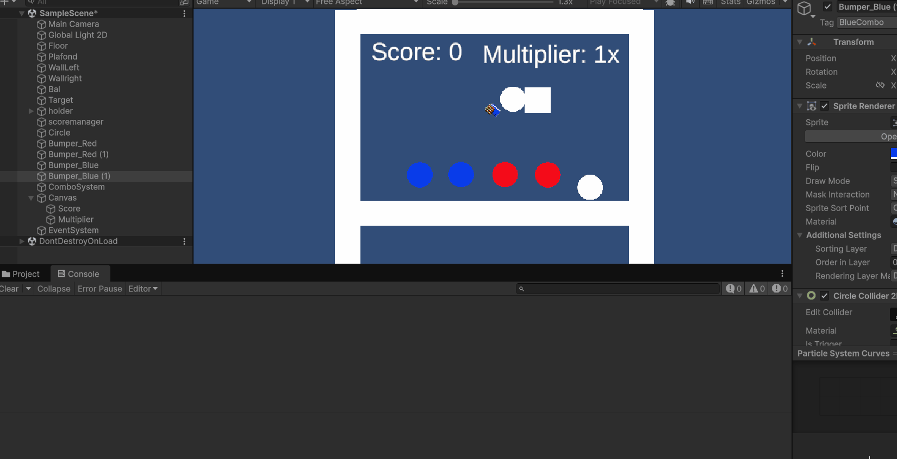
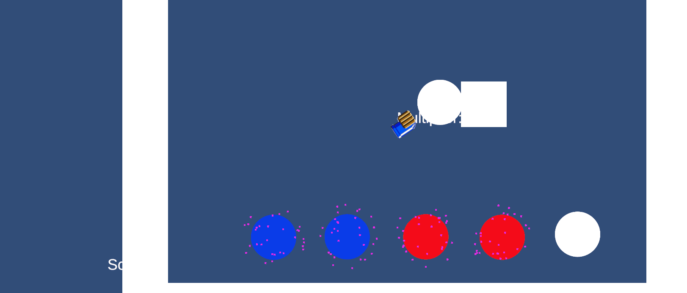

# M2_GDV2

# 1.1 GameConcept
Beschrijving Concept 

De speler schiet ijzeren ballen 
# 1.2 Random Items

Beschrijving:   Herhaling van datatypes, ik heb nummer 1 voor een willekeurig item, nummer 2 voor alle items.

Scripts: [Randomitems.cs](Assets/Scripts/randomitems.cs)

# 2.1 Forces & Collisons

Beschrijving: Add Force en Collider

Scripts: [Shootball.cs](Assets/Scripts/Shootball.cs)
Scripts: [Targetcollison.cs](Assets/Scripts/Targetcollison.cs)

# 2.2 Peggle Mikken

Beschrijving: Kanon en Mikken

Scripts: [Shoot.cs](Assets/Scripts/Shoot.cs)

Scripts: [Aim.cs](Assets/Scripts/Aim.cs)

# 3.1 Score & Triggers

Beschrijving: een Peggle die reageert wanneer de bal het object raakt, bijhoudt hoeveel hits er nog over zijn, punten doorgeeft aan de ScoreManager en verdwijnt zodra de ingestelde hoeveelheid hits is bereikt

Scripts: [Scoremanager.cs](Assets/Scripts/Scoremanager.cs)

# 3.2 Peggle Game, Combos, Multiplier, Events

Beschrijving: een combo systeem op basis van tags.

# 4.1 UI 

Beschrijving: Canvas en UI gebruiken voor text

# 4.2 Text Score 

Beschrijving: Score met text laten werken.

# 5.2 Particles, Sounds

Beschrijving: Particles aangemaakt en sound

# 6.1 Afronden & Uitbreiding

Beschrijving: Afronden Uitbreiding van me peggle game

